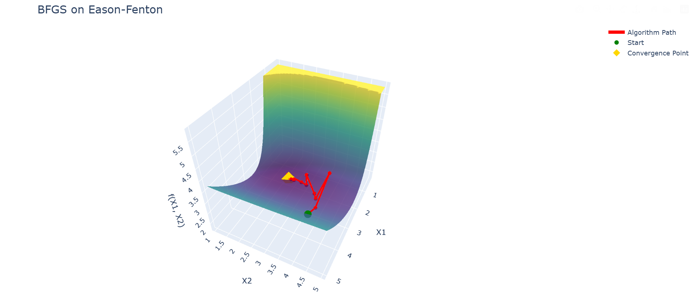
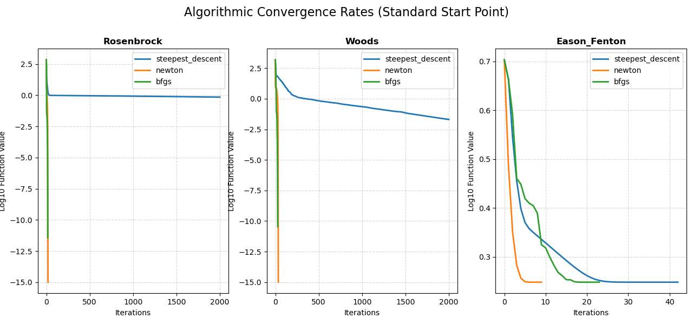
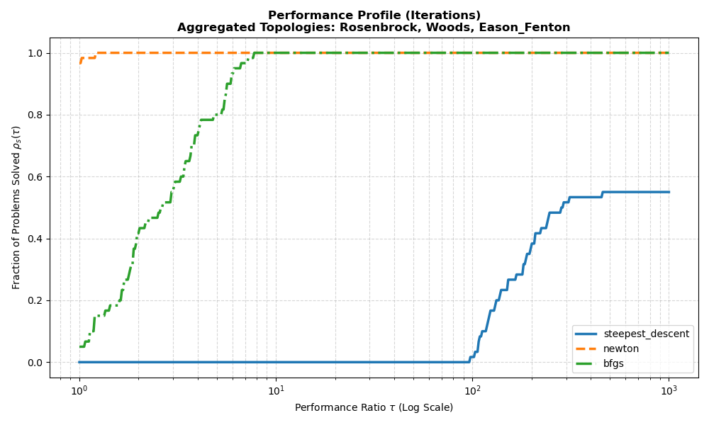
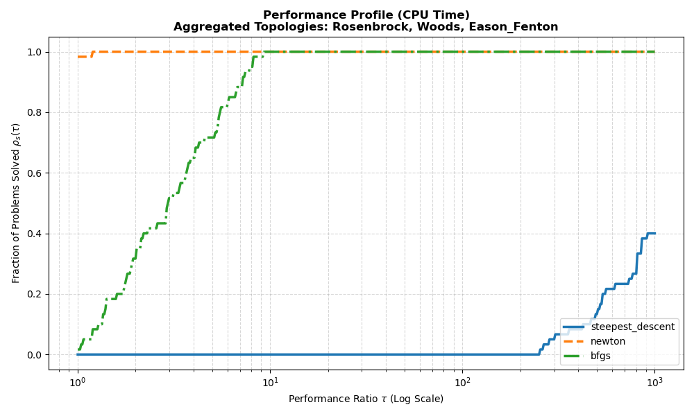
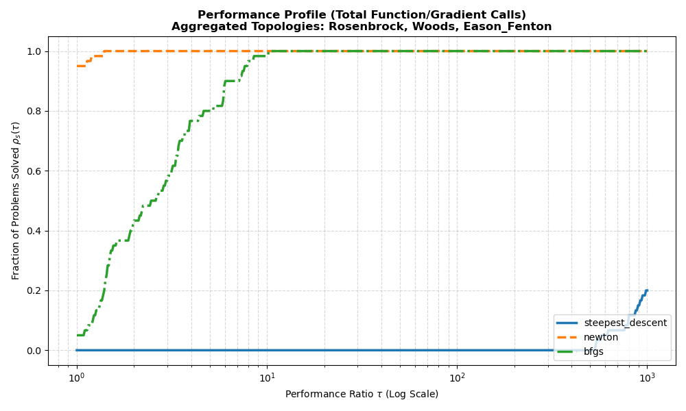

# Multivariable Optimization Algorithm Suite
**A Computational Engineering Framework for Unconstrained Non-Linear Optimization**
<p align="center">
  
</p>

This repository provides a  mathematically hardened suite of multivariable optimization algorithms. Built to analyze and solve highly non-convex objective topologies, the suite features advanced numerical safeguards, dynamically routed line search algorithms, and large-scale statistical benchmarking utilizing the **Dolan-Moré Performance Profile** methodology.

---

## Table of Contents
1. [System Architecture](#-system-architecture)
2. [Objective Topologies](#-objective-topologies)
3. [Statistical Benchmarking](#-statistical-benchmarking)
4. [Installation & Setup](#-installation--setup)
5. [Usage Guide](#-usage-guide)
6. [Project Structure](#-project-structure)
7. [Development Roadmap](#-development-roadmap)

---

##  System Architecture

The optimization engine is built on three core solvers, each addressing specific topological challenges and computational trade-offs.

### 1. First-Order: Steepest Descent
Serves as the baseline comparative metric. Utilizes the negative local gradient to navigate the surface.
* **Characteristics:** Strictly linear convergence rate. 
* **Limitations:** Highly susceptible to severe hemstitching (zig-zagging) in ill-conditioned valleys, resulting in extreme iteration counts.

### 2. Second-Order: Globally Convergent Modified Newton's Method
A mathematically robust implementation of Newton's Method designed to survive regions of negative curvature (saddle points) without diverging.
* **Levenberg-Marquardt Intervention:** At every iteration, the algorithm computes the exact eigenvalues of the Hessian matrix. If the minimum eigenvalue $\lambda_{\min} < 10^{-5}$, the algorithm applies a dynamic scalar shift $\tau$ to force the matrix into positive-definiteness:
  $$H_{mod} = H + \tau I \quad \text{where} \quad \tau = -\lambda_{\min} + 10^{-3}$$
* **Convergence:** Maintains ultra-fast quadratic convergence in convex regions while safely morphing into a steepest-descent trajectory to slide off saddle points.

### 3. Quasi-Newton: Damped BFGS
An advanced secant method that approximates the Inverse Hessian matrix iteratively, offering near-Newton speeds without the devastating $\mathcal{O}(N^3)$ computational cost of calculating analytical second derivatives.
* **Powell's Damping:** Standard BFGS fails if the curvature condition $s_k^T y_k > 0$ is violated. This implementation dynamically injects a damping factor $\theta$ and a synthetic gradient vector $r_k$ to guarantee the approximated Hessian remains positive-definite even in highly pathological, non-convex topologies.

###  Line Search Routing
The suite dynamically routes descent directions through one of three line search algorithms to compute the optimal step size $\alpha$:
* **Backtracking (Armijo):** A fast, contraction-based search (factor of $0.7$) enforcing sufficient decrease.
* **Exact Analytical:** A closed-form matrix solution strictly for quadratic topologies.
* **Pseudo-Strong Wolfe:** Enforces both sufficient decrease and slope reduction via sequential gating (pending Zoom phase integration).

---

## Objective Topologies

The algorithms are stress-tested against standard optimization benchmarks:

| Function | Dimensions | Characteristics | Global Minimum |
| :--- | :--- | :--- | :--- |
| **Rosenbrock** | 2D | The classic "Banana Function." Features a long, extremely narrow parabolic valley. | $f(x) = 0.0$ at $(1, 1)$ |
| **Wood's Function** | 4D | A highly non-convex space with complex saddle points and near-singular Hessian regions. | $f(x) = 0.0$ at $(1, 1, 1, 1)$ |
| **Eason-Fenton** | 2D | Multimodal topography with incredibly steep walls and flat plateaus. | $f(x) \approx -1.7101$ at $(\pm 1.74, \pm 2.72)$ |
| **Quadratic** | 2D | A perfectly convex bowl used for verifying Exact Line Search math. | $f(x) = 0.0$ at $(0, 0)$ |

---

##  Statistical Benchmarking

Single-run comparisons are mathematically insufficient for evaluating algorithmic robustness. This suite utilizes **Dolan-Moré Performance Profiles** (`benchmark.py`) to conduct large-scale empirical studies.

### 1. Convergence Rate Analysis
By tracking the $Log_{10}$ decay of the objective function value, we can visually verify the theoretical convergence properties of the solvers. Note the distinct quadratic plunge of Newton's Method compared to the linear plateau of Steepest Descent.

<p align="center">
  
</p>

### 2. Dolan-Moré Performance Profiles
To prove statistical dominance, the algorithms were tested against 90 randomized starting coordinates spanning the three topologies. The resulting Cumulative Distribution Functions (CDFs) map the Performance Ratio $\tau$ against the Fraction of Problems Solved $\rho$. 

*Note: A curve that is higher and further to the left represents a more robust and efficient algorithm.*

#### Iteration Efficiency
Newton's method dominates in raw algorithmic intelligence, solving nearly 100% of randomized topologies in the fewest possible steps. Steepest descent fails to converge within acceptable thresholds on highly non-convex features.
<p align="center">
  
</p>

#### Computational Cost (CPU Time)
When factoring in the $\mathcal{O}(N^3)$ cost of exact Hessian inversion, BFGS (green) effectively matches Newton's method (orange) in real-world wall-clock time, highlighting the efficiency of the secant approximation.
<p align="center">
  
</p>

### Hardware-Agnostic Computational Cost (Function/Gradient Calls)
While CPU time can fluctuate based on hardware and background OS processes, tracking the raw number of objective function and gradient evaluations provides a pure metric of algorithmic expense. In this profile, Newton's method maintains its lead due to its quadratic leaps, while Steepest Descent requires orders of magnitude more evaluations to satisfy the convergence tolerance.
<p align="center">
  
</p>
---

## Installation & Setup

### Prerequisites
* Python 3.8+
* Recommended: Virtual Environment (`venv` or `conda`)

### Step-by-Step Installation

1. **Clone the repository:**
   ```bash
   git clone [https://github.com/yourusername/optimization-suite.git](https://github.com/yourusername/optimization-suite.git)
   cd optimization-suite
   ```

2. **Create and activate a virtual environment (Optional):**

3. **Install the required dependencies:**
   ```bash
   pip install numpy matplotlib plotly 
   ```

---

## Usage Guide

The suite operates in two distinct modes: **Interactive** and **Benchmark**.

### 1. Interactive Analysis Mode
Use this mode to analyze a specific algorithm's behavior on a specific function from a defined starting point. Includes 3D WebGL visualizations of the algorithmic trajectory.

**Workflow:**
1. The CLI will prompt you to select an objective function (1-4).
2. Select the solver (1-3) and line search method (1-2).
3. Input your spatial starting coordinates (or press `Enter` to use the standard difficult defaults).
4. The console will output the optimal point, final objective value, and total iterations.
5. A **Plotly 3D interactive graph** will automatically open in your web browser showing the descent path.

### 2. Comprehensive Benchmarking Mode
Use this mode to evaluate the statistical dominance of the solvers. It runs all solvers against all functions from dozens of randomized starting points.

**Output:**
1. **Convergence Rate Plot:** A multi-panel Matplotlib figure showing $\log_{10}$ function value.
2. **Dolan-Moré Profiles:** Three successive plots evaluating the aggregated CPU Time, Iteration Efficiency, and Computational Cost (Function Calls) across the entire random sample space.

##  Project Structure

   ```text
   optimization-suite/
   │
   ├── optimization.py           # Core solver math (Steepest Descent, Newton, BFGS)
   ├── line_search.py            # Step-size algorithms (Armijo, Wolfe, Exact)
   ├── objective_functions.py    # Topology definitions, exact Gradients, and Hessians
   ├── benchmark.py              # Statistical engine and Dolan-Moré visualizer
   ├── main.py                   # CLI controller and Plotly 3D rendering engine
   └── README.md                 # Project overview and usage
   ```

---

##  Development Roadmap

- [ ] **Line Search Upgrades:** Integrate quadratic/cubic interpolation (Zoom Phase) into the Strong Wolfe line search to strictly guarantee the curvature condition.
- [ ] **BFGS Refactoring:** Replace the current $B_k = H_{inv}^{-1}$ inversion dependency in Powell's Damping with a Cholesky decomposition update to achieve true $\mathcal{O}(N^2)$ computational scaling for high-dimensional vectors.
- [ ] **Trust-Region Methods:** Expand the solver library to include Dogleg and Steihaug-CG trust-region algorithms.
